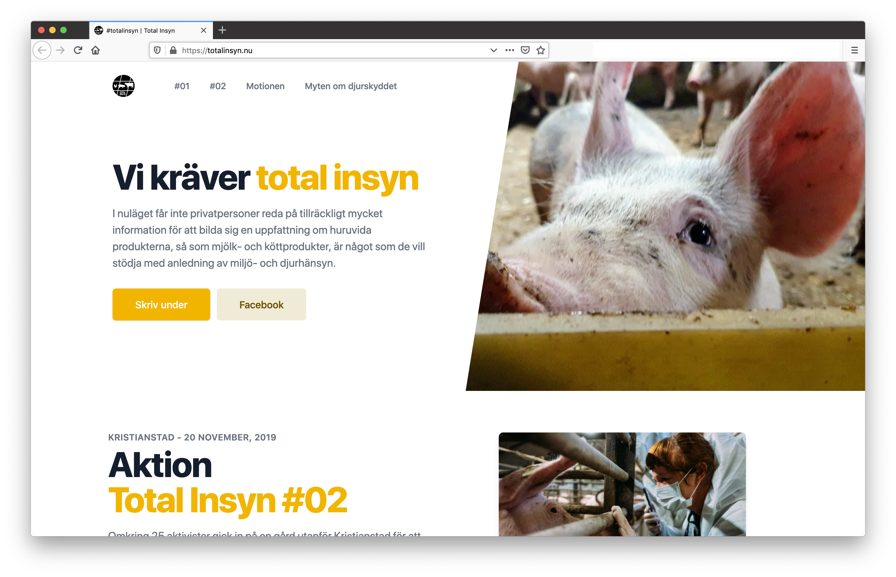

![Test status][tests]
<br />
<p align="center">
  <a href="https://github.com/othneildrew/Best-README-Template">
    
  </a>

  <h3 align="center">Total Insyn</h3>

  <p align="center">
      #totalinsyn is a campaign for total transparancy into every single farm and every single slaughterhouse in Sweden.
    <br />
    <a href="https://totalinsyn.nu"><strong>Visit the website »</strong></a>
    <br />
    <br />
    <a href="https://facebook.com/totalinsyn">Facebook</a>
    ·
    <a href="https://instagram.com/totalinsyn">Instagram</a>
    ·
    <a href="https://change.org/totalinsyn">Change.org</a>
  </p>
</p>

___



## Development

``` bash
# install dependencies
$ yarn install

# serve with hot reload at localhost:3000
$ yarn dev
```

[tests]: https://github.com/vegans/totalinsyn.nu/workflows/CI/badge.svg
